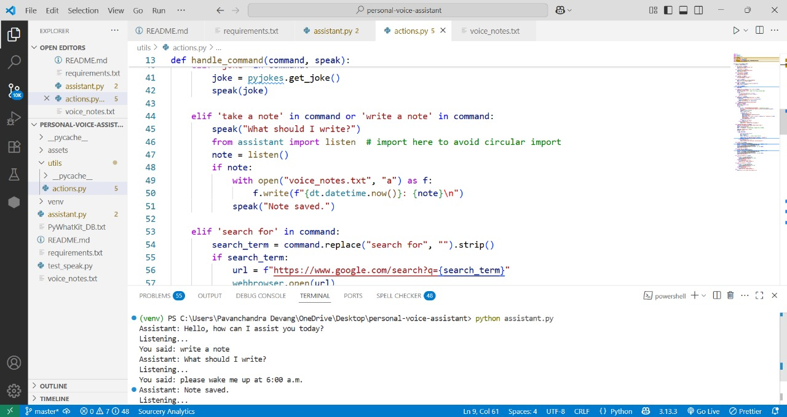
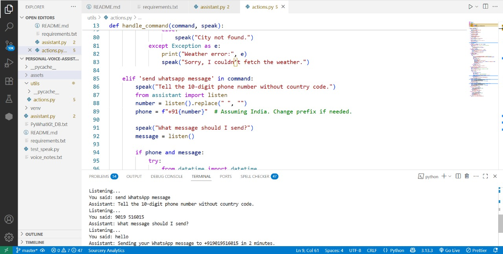
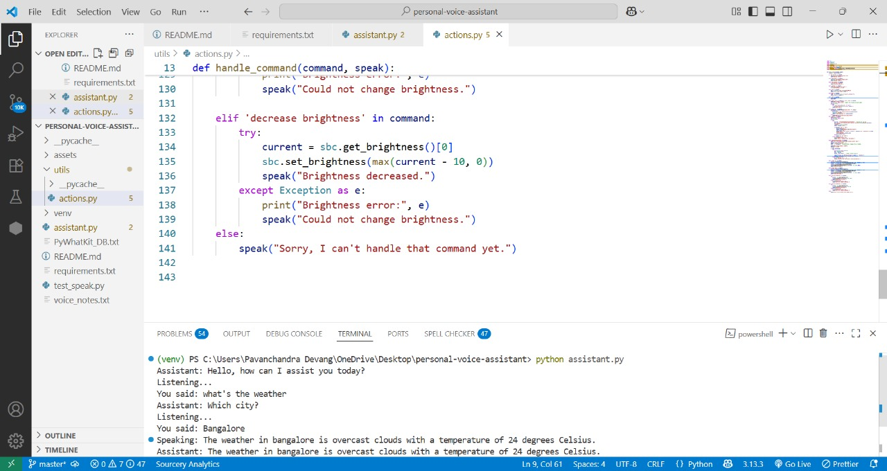

# 🎙️ Personalised Voice Assistant

A Python-based voice assistant that responds to voice commands, performs system-level operations, automates messaging, fetches weather, and more — all hands-free!

> **Tech Stack:** Python | NLP | Speech Recognition | Text-to-Speech | WhatsApp Automation | OpenWeatherMap API

---

## ✨ Features

- 🔊 **Real-time Voice Input & Output**
- 🌐 Open websites like YouTube, Google, Wikipedia
- 📦 Launch apps (e.g., Spotify, Chrome)
- ☁️ Fetch current weather of any city via voice
- 📱 Send WhatsApp messages using `pywhatkit`
- 💻 Control system volume and screen brightness
- 📝 Voice-to-note saving with timestamp
- 📅 Get current date and time

---

## Screenshots


| Note saved | Note WhatsApp Message Sent | Weather Fetch |
|---------------------------|------------------------|----------------|
|  |  |  |

---

## How It Works

```plaintext
🎤 Voice Input → 🧠 Command Analysis → ⚙️ System Action → 🔈 TTS Output
```
- Uses SpeechRecognition to convert voice to text  
- Parses the command using keyword matching  
- Executes actions: open apps, fetch weather, send WhatsApp messages, etc.  
- Responds using `pyttsx3` for text-to-speech

## Getting Started

1. Clone the Repo
```bash
git clone https://github.com/YOUR_USERNAME/personal-voice-assistant.git  
cd personal-voice-assistant
```
2. Set Up Virtual Environment
```bash
python -m venv venv
venv\Scripts\activate 
```
3. Install Requirements
```bash
pip install -r requirements.txt
```
4. Run the Assistant
```bash
python assistant.py
```


## Challenges Faced
1. **`datetime` Module Error**  
While adding note-taking and date features, we ran into:
```
UnboundLocalError: local variable 'datetime' referenced before assignment
```

__Cause__: Accidentally overwriting the imported `datetime` module inside the function by using `datetime = ....`

Fix: Renamed the import to avoid name conflict:
```
import datetime as dt
...
dt.datetime.now()
```
2. **ChatGPT API Deprecation**  
Initially added ChatGPT voice integration using `openai.ChatCompletion.create()`, but it broke due to OpenAI's v1.0+ update. Resolved by rewriting the code using the new SDK — then removed the feature due to quota limits.


## APIs Used
- OpenWeatherMap API for weather (`https://api.openweathermap.org`)
- pywhatkit for WhatsApp message automation

## Author
Pavanchandra Devang L
Feel free to connect with me on [LinkedIn](https://www.linkedin.com/in/pavanchandra-devang-l-01038616a/) and explore my work on [GitHub](https://github.com/Pavanchandra-15)  


---

## What You Should Update

- Replace `YOUR_USERNAME` with your actual GitHub username
- Add actual screenshots to `assets/screenshots/`
- If you plan to add a LICENSE file, use [MIT](https://choosealicense.com/licenses/mit/)

---

